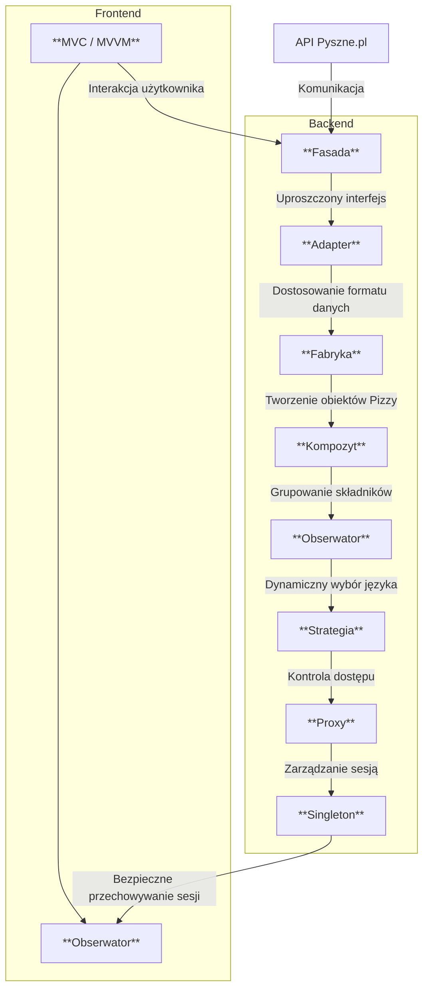

```mermaid
flowchart TD
    subgraph Frontend
        MVC[**MVC / MVVM**] --> Obserwator[**Obserwator**]
    end

    subgraph Backend
        Fasada[**Fasada**] -->|Uproszczony interfejs| Adapter[**Adapter**]
        Adapter -->|Dostosowanie formatu danych| Fabryka[**Fabryka**]
        Fabryka -->|Tworzenie obiektów Pizzy| Kompozyt[**Kompozyt**]
        Kompozyt -->|Grupowanie składników| ObserwatorB[**Obserwator**]
        ObserwatorB -->|Dynamiczny wybór języka| Strategia[**Strategia**]
        Strategia -->|Kontrola dostępu| Proxy[**Proxy**]
        Proxy -->|Zarządzanie sesją| Singleton[**Singleton**]
    end

    API_Pyszne[API Pyszne.pl] -->|Komunikacja| Fasada
    MVC -->|Interakcja użytkownika| Fasada
    Singleton -->|Bezpieczne przechowywanie sesji| Obserwator

```