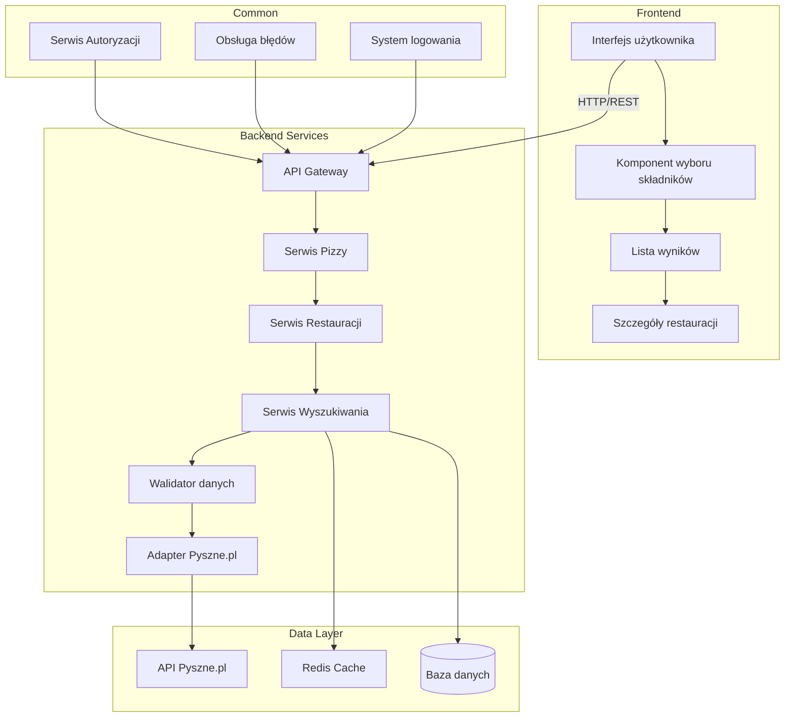

# Pizza Finder 

# Opis projektu

Pizza Finder to aplikacja webowa umożliwiająca użytkownikom wyszukiwanie i porównywanie ofert pizzy z różnych restauracji. Głównym celem jest ułatwienie procesu wyboru pizzy poprzez zaawansowane filtrowanie i sortowanie wyników.

## Główne funkcje

- Wyszukiwanie pizzy po nazwie, składnikach i restauracji
- Filtrowanie wyników według:
  - Ceny
  - Czasu dostawy
  - Składników
  - Lokalizacji restauracji
- Porównywanie cen tej samej pizzy z różnych restauracji
- Zapisywanie ulubionych pizz i restauracji

## Korzyści dla użytkownika
- Oszczędność czasu przy wyborze pizzy
- Łatwe porównywanie cen
- Personalizacja wyników
- Szybki dostęp do ulubionych pozycji

## Grupa docelowa
- Studenci i młodzi profesjonaliści
- Rodziny zamawiające pizzę do domu
- Osoby poszukujące najlepszych ofert
- Miłośnicy pizzy szukający nowych smaków

# Wymagania funkcjonalne

1. Wyszukiwanie i filtrowanie
   - System umożliwia wyszukiwanie pizzy po nazwie
   - System pozwala na filtrowanie wyników po składnikach
   - System umożliwia sortowanie wyników po ilości składników, cenie i czasie dostawy
   - System wyświetla szczegółowe informacje o każdej pizzy

2. Zarządzanie kontem użytkownika
   - Użytkownik może utworzyć konto
   - Użytkownik może się zalogować/wylogować
   - Użytkownik może edytować swój profil
   - Użytkownik może zarządzać swoimi preferencjami

3. Ulubione i historia
   - Użytkownik może dodawać pizze do ulubionych
   - System zapisuje ostatnie wyszukiwania

# Wymagania niefunkcjonalne

1. Wydajność
   - Czas odpowiedzi systemu poniżej 2 sekund
   - Obsługa minimum 1000 równoczesnych użytkowników
   - Dostępność systemu na poziomie 99.9%
   - Efektywne cachowanie często wyszukiwanych wyników

2. Bezpieczeństwo
   - Szyfrowanie danych użytkowników
   - Bezpieczne przechowywanie haseł
   - Ochrona przed atakami CSRF i XSS
   - Regularne kopie zapasowe danych

3. Użyteczność
   - Intuicyjny interfejs użytkownika
   - Responsywny design (mobile-first)
   - Wsparcie dla różnych przeglądarek
   - Czas ładowania strony poniżej 3 sekund
   - Wielojęzyczność

4. Skalowalność
   - Elastyczna architektura pozwalająca na rozbudowę
   - Możliwość obsługi wzrostu ruchu
   - Modułowa struktura kodu

# Specyfikacja techniczna

## Frontend
- **Framework**: React/Angular
- **State Management**: Redux/MobX 
- **UI Components**: Material-UI/Tailwind
- **Responsive Design**

## Backend
- **Framework**: Spring Boot/Node.js
- **API Gateway**: Spring Cloud Gateway/Express Gateway
- **Walidacja**: JSON Schema
- **Cache**: Redis
- **Database**: PostgreSQL

## Integracje
- REST API Pyszne.pl
- JWT Authentication
- Rate Limiting
- Circuit Breaker

## Funkcjonalności
- Wielokryterialne wyszukiwanie pizzy
- Filtrowanie po składnikach
- Sortowanie wyników (cena, ocena, czas dostawy)
- Cachowanie popularnych wyników
- Obsługa błędów API
- Monitoring i logowanie

## Bezpieczeństwo
- HTTPS
- API Key Management
- Input Sanitization
- Rate Limiting
- CORS Policy

## Monitoring
- Health Checks
- Performance Metrics
- Error Tracking
- User Analytics

# Architektura

## Common

### AuthService (Serwis Autoryzacji)
- Odpowiada za uwierzytelnianie i autoryzację użytkowników
- Zarządza tokenami JWT
- Kontroluje dostęp do różnych części aplikacji

### ErrorHandler (Obsługa błędów)
- Centralne miejsce do obsługi wszystkich błędów w systemie
- Standaryzuje format odpowiedzi błędów
- Może zawierać logikę retry (ponownych prób) dla nieudanych operacji

### Logger (System logowania)
- Zapewnia spójne logowanie w całej aplikacji
- Zbiera informacje o działaniu systemu
- Pomaga w debugowaniu i monitorowaniu

#### Charakterystyka komponentów wspólnych:
- Są używane przez wiele różnych części systemu
- Zapewniają przekrojową funkcjonalność (cross-cutting concerns)
- Centralizują ważne aspekty bezpieczeństwa i monitorowania
- Wszystkie komunikują się z API Gateway, który jest głównym punktem wejścia do backend'u

## Frontend

### UI (Interfejs użytkownika)
- Główny komponent odpowiedzialny za interakcję z użytkownikiem
- Komunikuje się z backendem poprzez API Gateway używając HTTP/REST

### PizzaSelector (Komponent wyboru składników)
- Pozwala użytkownikowi na wybór składników pizzy
- Przekazuje wybrane kryteria do listy wyników

### ResultsList (Lista wyników)
- Wyświetla wyniki wyszukiwania
- Umożliwia przejście do szczegółów restauracji

### RestaurantDetails (Szczegóły restauracji)
- Pokazuje szczegółowe informacje o wybranej restauracji
- Wyświetla menu i dostępne opcje

## Backend

### APIGateway
- Główny punkt wejścia dla wszystkich żądań
- Integruje się z serwisami AuthService, ErrorHandler i Logger

### PizzaService (Serwis Pizzy)
- Zarządza logiką związaną z pizzami
- Komunikuje się z serwisem restauracji

### RestaurantService (Serwis Restauracji)
- Obsługuje informacje o restauracjach
- Przekazuje żądania do serwisu wyszukiwania

### SearchService (Serwis Wyszukiwania)
- Implementuje logikę wyszukiwania
- Korzysta z walidatora danych
- Zarządza cache'm i bazą danych

### DataValidator (Walidator danych)
- Sprawdza poprawność danych
- Współpracuje z adapterem Pyszne.pl

### PyszneAdapter (Adapter Pyszne.pl)
- Dostosowuje komunikację z zewnętrznym API Pyszne.pl

## Data Layer

### PyszneAPI (API Pyszne.pl)
- Zewnętrzne API dostarczające dane o restauracjach i pizzach

### Cache (Redis Cache)
- Przechowuje popularne wyniki wyszukiwania
- Przyspiesza odpowiedzi dla częstych zapytań

### Database (Baza danych)
- Przechowuje trwałe dane aplikacji
- Obsługiwana przez PostgreSQL

